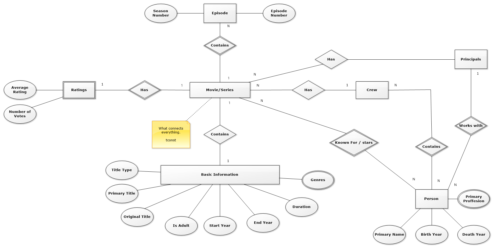

# Database exercise 3 (ER Diagram)
This repository is a exercise project for Software development (PBA) Database course. Daniel (cph-dh136)

## Description
This excercise is to practise and try design a conceptual Entity Relationship Diagram for IMDB's interface data. provided at: [http://www.imdb.com/interfaces/](http://www.imdb.com/interfaces/)

The exercise description is [Here](https://github.com/datsoftlyngby/soft2018spring-databases-teaching-material/blob/master/lecture_notes/06-SQL%20and%20modeling.ipynb)

## Diagram

## Notes
Discussing ERD is a matter of sematincs. There is so many styles out there. Why hasn't someone said "THIS ONE" is the definit style we use.
